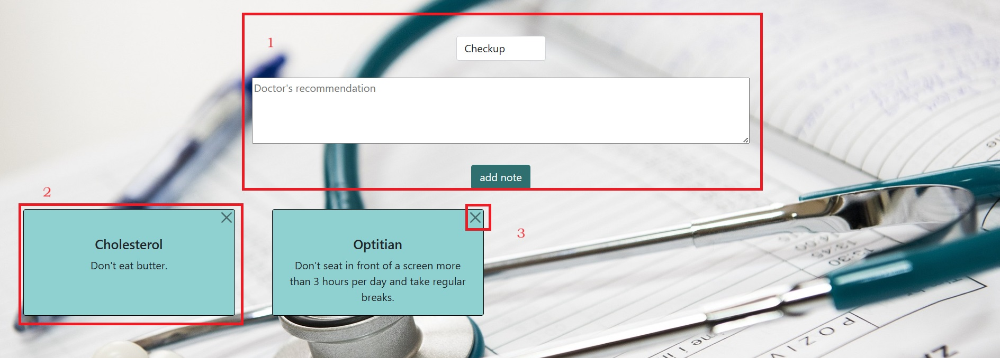

# Gesundheit!
#### Video Demo: <https://www.youtube.com/watch?v=cZ1rpF3BqL8>
### Description:

#### 1. Purpose:
"Gesundheit!" (German: health) is a web based application which purpose is to help you track routine medical checkups.
The ones that happen only occasionally and people tend to forget about them.

#### 2. Layout:
**Log in/register**

**Main page:** upon logging in the user can see a calendar preview with all their checkups. In the nav bar there also is an information about which user is currently logged in.

**Checkups:** tab where users can add custom checkups, edit appointment dates, display history and delete records. The page is connected to the calendar  - events added in checkups are displayed in it.

**Doctor's advice:** tab where user can add notes and delete them. These notes are supposed to be doctor's recommendations.

#### 3. How to register and log in


All forms have to be filled to register a user.

Username should have at least 5 characters and only letters and numbers are allowed.

Date of birth is necessary as the user has to be at least 18yo to use the app and based on the age of the user recommended checkup schedule is rendered. The date is also used at a later stage to for example prevent the user from adding a check up date on a day before they were even born.

Gender is important as based on it the preset list of recommended checkups is rendered. Of course if someone does not wish to disclose this information they can choose "Prefer not to say" in which case the list of recommended checkups will not be filtered (e.g. it will show both prostate exam and pap smear).

User also has to provide a password that is at least 8 characters long and repeat it.

There will be error messages displayed if any field is incorrectly filled.

Once registration is succesfull the user will be automatically redirected to the log in page.

#### 4. What is available for a logged in user


Logged in user has access to app's functionalities:
 - main page with a calendar
 - checkups tab
 - doctor's advice
 - log out option
 - navbar also displays the currently logged user

 #### 5. Checkups


This is the most interactive page.

In it's default state it will display a list of routine checkups (4) which are stored in a provided database.

If the user is not satisfied with the selection it can add a custom checkup (1) which will then be displayed on the bottom of the table (5).

The purpose of the app is to track the routine checkups and make sure they are done reguraly. User can add the appointments they had by submiting a form (2). First a checkup has to be selected from a drop down menu. The list contains the preselected checkups as well as the checkups added by the user.

User has to add the latest checkup date. The code is written in a way that prevents the user from inserting a date in a future, a date in a past that is before their birtday, a date that is later than next checkup date in case next checkup is also being added.

User cannot insert only next checkup without adding a latest checkup.

Once a record is added, the dates will be displayed in latest and next checkup columns. In case there is more than one date added for a checkup, only the most recent one will be visible in the main table.

If a user does not insert a checkup date, a recommended checkup date will be generated (7). This recommended date is calculated automatically as disclaimed on the page (6).

If a user adds a latest checkup date further in the past than recommended cycle, for example 5 years the app will not simply add 3 or 1 year (as in that case the recommended next checkup would be in the past), it will suggest the user to schedule an apointment as soon as possible.

The user also has an option to check the history off all the records they have added but submitting a form (3). In this view they also have an option to delete a record if it was for example added with an error.

The information submited by the user is stored in a db. Custom checkups are only available for the user who added them.

#### Doctor's advice



The user can also track their doctors' advice.
In the Doctor's advice tab they can pick a checkup from the select menu (the list will also contian the custom checkups if any were created) and write the recommendation in the text field. Once the form (1) is submitted, a sticky note alike will be generated (2).

User has an option to delete (3) a note that is no longer relevant or was perhaps added by mistake. The record will be permanently removed from a database.

#### Main page / calendar


Logged users (1) are able to see a calendar on the main page.
Provided buttons (2) allow the user to move back and forth in time to see their appointment. It is also a pleasnt visualisation of checkups scheduled for a given month.

When a new user is setup, the calendar will be empty, only once the user starts adding their checkup dates, they will appear on the calendar (3).

#### Files and folders


- static:
    - js: java script correspondiong with layout and index templates
    - screenshots: used in README.md
    - icon
    - bacground used on the page

- templates: functions of each explained above
- health.db: database provided with the app

```
     - CREATE TABLE user_checkups (
        id INTEGER PRIMARY KEY AUTOINCREMENT NOT NULL,
        users_id INTEGER NOT NULL,
        checkups_id INTEGER NOT NULL,
        last_checkup DATE,
        next_checkup DATE
        ); -> table stores the checkups dates inserted by the user through checkups.html

    - CREATE TABLE recommendations (
        id INTEGER PRIMARY KEY AUTOINCREMENT NOT NULL,
        users_id INTEGER NOT NULL,
        checkups_id INTEGER NOT NULL,
        recommendation TEXT NOT NULL
        ); -> table stores doctor's recommendations inserted by the user through recommendations.html

    - CREATE TABLE checkups (
        id INTEGER PRIMARY KEY AUTOINCREMENT NOT NULL,
        checkup_name TEXT NOT NULL,
        is_preset BOOLEAN NOT NULL,
        for_gender TEXT NOT NULL,
        users_id INTEGER
        ); -> table stores the list of checkups. Some checkups are preset but user can add custom checkups through checkups.html

    - CREATE TABLE users (
        id INTEGER PRIMARY KEY AUTOINCREMENT NOT NULL,
        username TEXT NOT NULL,
        birthday DATE NOT NULL,
        age INTEGER NOT NULL,
        sex TEXT NOT NULL,
        hash TEXT NOT NULL
        ); -> table stores users' data submitted through register.html

```


